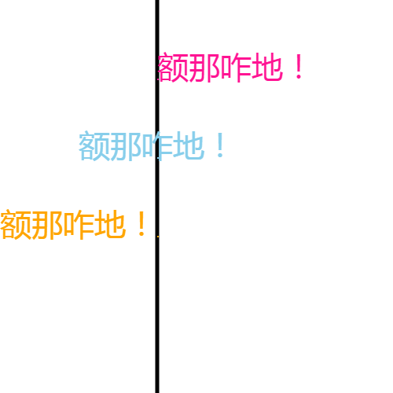
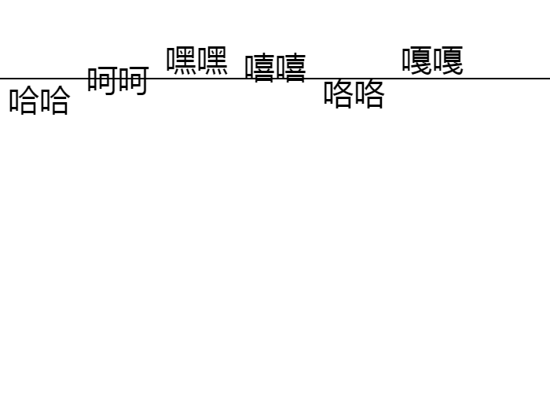

#canvas 第二天

###方法

> 1.forEach

语法：数组.forEach(function ( val, index, arr ) {});遍历到的值，该值的下标，原数组
```
var arr = ['a','b','c','d'];
        arr.forEach(function ( val, index, arr ){
            console.log(val, index, arr);
        });
        //a 0 ["a", "b", "c", "d"]
          b 1 ["a", "b", "c", "d"]
          c 2 ["a", "b", "c", "d"]
          d 3 ["a", "b", "c", "d"]
```

> 2.map

语法：数组.map(function ( val, index, arr ) { return val * 10 });map会自动帮我们遍历数组，每遍历到数组中的一个值，就会调用回调，并且给回调传三个参数：遍历到的值，该值的下标，原数组
         
```
 var arr = ['a','b','c','d'];
        var newArr = arr.map(function ( val, index, arr ){
            return val + 'pp';
        });
        console.log(newArr);
//["app", "bpp", "cpp", "dpp"]
        var arr2 = [11,22,33,44];
        var newArr2 = arr2.map(function ( val ) {
            return val * 5;
        });
        console.log(newArr2);
        //[55, 110, 165, 220]
```

> 3.经典面向对象"等比例缩放坐标轴"

```
(function ( w ) {
    /*
     * constructor { Coordinate } 坐标轴构造函数
     * param { paddings: Array } 坐标轴距离画布上、右、下、左的距离
     * param { arrow: Array } 里面存储坐标轴中箭头的宽高
     * param { points: Array } 里面存储的是相当于自定义坐标轴原点的位置
     * */
    function Coordinate( ctx, points, paddings, arrow  ) {

        // 绘图上下文
        this.ctx = ctx;

        // 要绘制的源数据
        this.points = points;
        // 根据源数据计算绘制的坐标
        this.pointsCoord = [];

        // 坐标轴与画布的路径
        paddings = paddings || [];
        this.paddingTop = paddings[0] || 10;
        this.paddingRight = paddings[1] || 10;
        this.paddingBottom = paddings[2] || 10;
        this.paddingLeft = paddings[3] || 10;

        // 坐标轴中箭头的宽高
        arrow = arrow || [];
        this.arrowWidth = arrow[0] || 10;
        this.arrowHeight = arrow[1] || 20;

        // 等比缩放源数据，并根据缩放后的数据计算绘制的坐标
        this.initPoint();

        // 初始化上顶点、圆点、右顶点的坐标
        this.init();
    }

    Coordinate.prototype = {

        // 拟补constructor丢失的问题
        constructor: Coordinate,

        // 初始化上顶点、圆点、右顶点的坐标
        init: function () {
            // 坐标轴中上顶点的坐标
            this.s = {
                x: this.paddingLeft,
                y: this.paddingTop
            }
            // 坐标轴中原点的坐标右顶点
            this.o = {
                x: this.paddingLeft,
                y: this.ctx.canvas.height - this.paddingBottom
            }
            // 坐标轴中右顶点的坐标
            this.h = {
                x: this.ctx.canvas.width - this.paddingRight,
                y: this.ctx.canvas.height - this.paddingBottom
            }

            // 根据数据转换为坐标
            var i = 0, len = this.points.length;
            for ( ; i < len; i+=2 ) {
                // this.pointsCoord = [ [转换后的x坐标,转换后的y坐标],[x,y]... ];
                this.pointsCoord.push( [ this.o.x + this.points[i], this.o.y - this.points[i+1] ] );
            }

        },

        // 转换坐标轴最大可显示的值
        initPoint: function () {

            var self = this;
            var i = 0, len = this.points.length,
                pointsX = [], pointsY = [],
                coordMaxX, coordMaxY;

            // 求坐标轴默认显示的最大刻度
            this.coordMaxX = this.ctx.canvas.width - this.paddingLeft - this.paddingRight - this.arrowHeight;
            this.coordMaxY = this.ctx.canvas.height- this.paddingTop - this.paddingBottom - this.arrowHeight;

            /*
             * 把坐标轴可显示的数据最大值进行转换：
             * 遍历所有的点，
             * 点中最大的x轴作为预期坐标轴的x最大值
             * 点中最大的y轴作为预期坐标轴的y最大值
             * */

            // 找出所有的x轴和y轴
            for ( ; i < len; i++ ) {
                if (i % 2 === 0 ) {
                    pointsX.push( this.points[i] );
                }else {
                    pointsY.push( this.points[i] );
                }
            }

            // 求出预期的坐标轴最大刻度
            coordMaxX = Math.max.apply( null, pointsX );
            coordMaxY = Math.max.apply( null, pointsY );

            /*
             * 现在求出的最大刻度，是我们预想坐标轴可显示的最大刻度，
             * 实际上坐标轴显示的刻度，没有任何变化，
             * 我们需要使用坐标轴默认刻度 / 预期刻度得到一个比值，
             * 然后通过这个比值对源数据进行缩放。
             * */
            this.points = this.points.map(function ( val, index ) {
                if ( index % 2 === 0 ) {
                    return self.coordMaxX / coordMaxX * val;
                }else {
                    return self.coordMaxY / coordMaxY * val;
                }
            });

        },

        // 折线图绘制方法
        draw: function () {
            this._drawLine();
            this._drawArrow();
            this._drawPoint();
            this._drawPerfline();
        },

        // 绘制坐标轴中的两条线
        _drawLine: function () {
            this.ctx.beginPath();
            this.ctx.moveTo( this.s.x, this.s.y );
            this.ctx.lineTo( this.o.x, this.o.y );
            this.ctx.lineTo( this.h.x, this.h.y );
            this.ctx.stroke();
        },

        // 绘制坐标轴中的两个箭头
        _drawArrow: function () {
            this.ctx.beginPath();

            // 先画上箭头
            this.ctx.moveTo( this.s.x, this.s.y );
            this.ctx.lineTo( this.s.x - this.arrowWidth / 2, this.s.y + this.arrowHeight );
            this.ctx.lineTo( this.s.x, this.s.y + this.arrowHeight / 2 );
            this.ctx.lineTo( this.s.x + this.arrowWidth / 2, this.s.y + this.arrowHeight );
            this.ctx.lineTo( this.s.x, this.s.y );

            // 再画右箭头
            this.ctx.moveTo( this.h.x, this.h.y );
            this.ctx.lineTo( this.h.x - this.arrowHeight, this.h.y - this.arrowWidth / 2 );
            this.ctx.lineTo( this.h.x - this.arrowHeight / 2, this.h.y );
            this.ctx.lineTo( this.h.x - this.arrowHeight, this.h.y + this.arrowWidth / 2 );
            this.ctx.lineTo( this.h.x, this.h.y );

            this.ctx.stroke();
        },

        // 在坐标轴中绘制点
        _drawPoint: function () {
            var self = this;
            this.ctx.beginPath();

            // 根据坐标绘制点
            // this.pointsCoord = [ [转换后的x坐标,转换后的y坐标],[x,y]... ];
            this.pointsCoord.forEach(function ( pointsCoord ) {
                self.ctx.fillRect( pointsCoord[0], pointsCoord[1], 2, 2);
            });

            this.ctx.stroke();
        },

        // 绘制折线
        _drawPerfline: function () {
            var self = this;
            this.ctx.beginPath();

            // 绘制折线
            this.pointsCoord.forEach(function ( pointsCoord ) {
                self.ctx.lineTo( pointsCoord[0], pointsCoord[1] );
            });

            this.ctx.stroke();
        }
    };

    // 把构造函数暴漏到全局,使Coordinate可以作为window的方法去调用
    w.Coordinate = Coordinate;

}( window ));
```

> 3.arc ：画弧路径

语法：ctx.arc( 圆心x轴坐标，圆心y轴坐标，半径，起始弧度，结束弧度，是否逆时针画(可选))
arc方法会先使用lineTo方法移动到弧的起始位置，然后开始画弧。
```
ctx.arc( 100, 200, 50, Math.PI / 2, Math.PI );
        ctx.stroke();
```
> 4.角度转换弧度的方法

```
function angleToRadio( angle ) {
            // Math.PI / 180 得到1角度对应多少弧度
            return Math.PI / 180 * angle;
        }
```             
> 5.画扇形


画扇：
1、先设置路径起点为圆心
2、然后画弧
3、通过closePath方法自动把路径结束点与起点相连
       
```
var x = 100, y = 100, r = 50;
ctx.moveTo( x, y );
ctx.arc( x, y, r, 0, Math.PI / 2 );
ctx.closePath();
ctx.stroke();
```

> 6.饼图

```
(function ( w ) {

    /*
    * constructor { Pie } 饼图构造函数
    * param { x: number } 饼图圆心x轴坐标
    * param { y: number } 饼图圆心y轴坐标
    * param { r: number } 饼图半径
    * param { data: Array } 绘制饼图所需的数据
    * */
    function Pie( x, y, r, data ) {
        this.x = x;
        this.y = y;
        this.r = r;
        this.data = data;

        // 扇形的颜色
        this.colors = [ 'skyblue', 'deeppink', 'orange', 'yellow', 'red', 'green' ];

        // 计算1数据所对应的角度值
        this.init();
    }

    /*
     * 给Pie添加一个静态方法，
     * 该方法会把角度转换为弧度
     * */
    Pie.angleToRadius = function( angle ) {
        // Math.PI / 180 得到1角度对应多少弧度
        return Math.PI / 180 * angle;
    };

    Pie.prototype = {

        // 拟补constructor丢失的问题
        constructor: Pie,

        // 求1数据对应的角度 = 360度 / 数据的总和
        init: function () {
            var num = 0;
            this.data.forEach(function ( val ) {
                num += val;
            });

            // 1数据所对应的角度值
            this.baseAngle = 360 / num;
        },

        // 绘制饼图
        draw: function () {
            var self = this,
                startAngle = 0,
                endAngle = 0;

            // 根据数据，画扇，共同组成一个饼图。
            this.data.forEach(function ( val, index ) {
                // 计算当前扇形的结束角度
                endAngle = startAngle + self.baseAngle * self.data[index];
                // 画扇
                ctx.beginPath();
                ctx.moveTo( self.x, self.y );
                ctx.arc( self.x, self.y, self.r, Pie.angleToRadius(startAngle), Pie.angleToRadius(endAngle));
                ctx.closePath();
                ctx.fillStyle = self.colors[index];
                ctx.fill();
                // 下一个扇形的起点，是当前扇形的结束点
                startAngle = endAngle;
            });
        }
    };

    // 把构造函数暴露到全局
    w.Pie = Pie;

}( window ));


var pie = new Pie( 100, 100, 50, [2, 5, 10, 6, 3] );
        pie.draw();
```
> 7.绘制文本

- 设置文本样式
    ctx.font = 语法和css一样
    -  `ctx.font = '500 2em 微软雅黑';`
- 绘制描边文本  
    ctx.strokeText( '文本', x, y, 限制文本最大长度(可选) )
    - `ctx.strokeText( '嘿！', 100, 100 );`
- 绘制填充文本
ctx.strokeText( '文本', x, y, 限制文本最大长度(可选) )
    - `ctx.fillText( '恩那咋地！', 200, 100 );`
- 设置文字水平排列方式
ctx.textAlign = start(left)、center、end(right)  默认为值为start。

- 设置文字垂直排列方式
ctx.textBaseline = top、middle、bottom、alphabetic、 hanging、ideographic
默认为值为alphabetic(字母基线)。
      - top在四线三格的上面；
      * middle在四线三格的中间；
      * bottom在四线三格的下间；
      * alphabetic在四线三格中第三条线；
      * hanging相当于四线三格中第一条线；
      * ideographic表示和bottom基本一致。
      
> 代码示例

```
ctx.moveTo( 0, 100 );
    ctx.lineTo( cvs.width, 100 );
    ctx.lineWidth = 2;
    ctx.stroke();

    ctx.textBaseline = 'top';
    ctx.fillText( '哈哈', 10, 100 );

    ctx.textBaseline = 'middle';
    ctx.fillText( '呵呵', 110, 100 );

    ctx.textBaseline = 'bottom';
    ctx.fillText( '嘿嘿', 210, 100 );

    ctx.textBaseline = 'alphabetic';
    ctx.fillText( '嘻嘻', 310, 100 );

    ctx.textBaseline = 'hanging';
    ctx.fillText( '咯咯', 410, 100 );

    ctx.textBaseline = 'ideographic';
    ctx.fillText( '嘎嘎', 510, 100 );
```

> 8.绘制图像

   - 三参数
   绘制图像，drawImage三参数：
   ctx.drawImage( 图像资源，x坐标，y坐标 )
   把图像绘制到指定的位置。
   - 绘制图像，drawImage五参数：
    ctx.drawImage( 图像资源，x坐标，y坐标, 图像显示的宽，图像显示的高 )
    把图像按照指定的大小绘制到指定的位置。
   - 绘制图像，drawImage九参数：
    ctx.drawImage( 图像资源，
    裁剪的x坐标，裁剪的y坐标，裁剪多宽，裁剪多高，
    x坐标，y坐标, 图像显示的宽，图像显示的高 ) 
    // 裁剪的x轴坐标控制着每一个方向的不同动作
    // 裁剪的y轴坐标控制着小人行走的方向
    把裁剪到的图像按照指定的大小绘制到指定的位置。
    
### 在使用某个img之前，必须监听它onload事件
       
```
img.onload = function () {
      ctx.drawImage( img,
       0, 0, 40, 65,
       10, 10, 100, 200 );
    }
```

### 帧动画

> 

```
var img = new Image();
img.src = './imgs/NPCrabbitbaby.png';
img.addEventListener('load', function () {
var index = 0;
setInterval(function () {
ctx.clearRect(0, 0, cvs.width, cvs.height);
// 裁剪的x轴坐标控制着每一个方向的不同动作
// 裁剪的y轴坐标控制着小人行走的方向
ctx.drawImage( img,
40 * index, 65 * 2, 40, 65,
10, 10, 40, 65);
index = ++index > 3? 0 : index;
}, 1000 / 15);
});
```