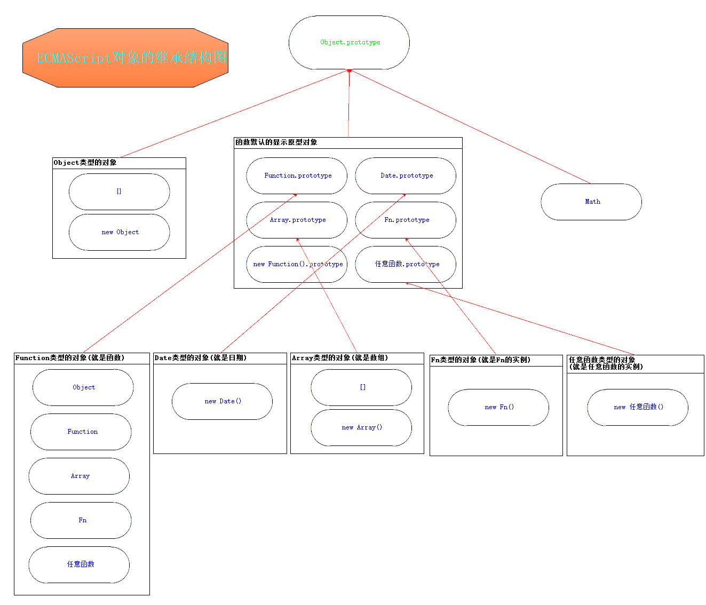
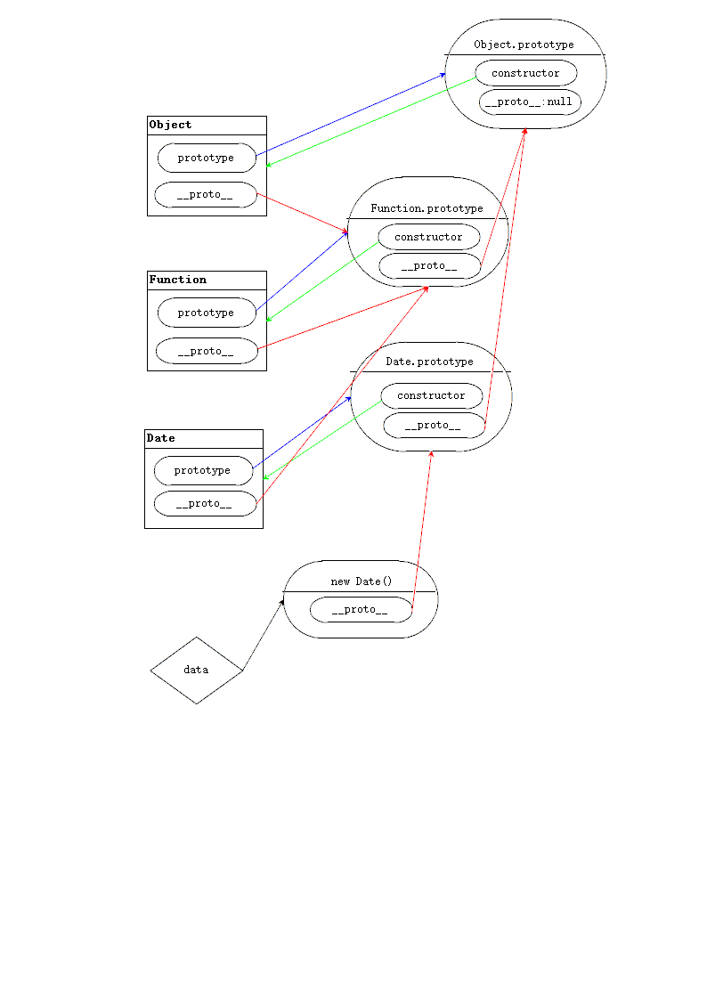

## 面向对象第三天

####构造函数的默认的prototype的继承结构

```
function Person(){}
var xioahong=new Person()
    原型链
//xiaohong==>Person.prototype==>Object.prototype==>null
```

- {}是new Object的简写形式
>  obj==>Object.prototype==>null

- []是arr的字面量
> arr ==> Array.prototype ==> Object.prototype ==> null

- Math的继承结构
> Math ==> Object.prototype ==> null

- strObj的继承结构
> strObj ==> String.prototype ==> Object.prototype ==> null

#####函数的显示原型都继承 Object.prototype
> 原型链的概念：

一个对象继承的所有对象，被形象的称为对象的原型链
注释：原型链是一个描述对象继承结构，相对比较形象的词汇；

####继承的规律：

1. 谁的实例，这个实例就继承谁的prototype
2. 所有对象继承的终点是Object.prototype
3. 所有函数默认的显示原型 都继承 Object.prototype
4. 所有的函数，都被看做是Function的实例，；所以都继承Function.prototype
5. 所有的数组，都被看做是Array的实例，所以都继承Array.prototype
6. 所有的正则，都被看做RexExp的实例，所以都继承Regexp.prototype.

####对象的的类型

-  在js中，函数比较特殊，他们都是Function类型的对象，但是可以配生出属于自己类型的对象
- Date自身是Function类型，但是通过new Date创建出来的所有实例是Date类型
- ECMAscript内置的----函数类型的对象:
    - String Number Boolean RegExp Function  Object Array Error Date 
- 上述九大构造函数的原型链结构:
    - 9大构造函数==>Function.prototype==>Object.prototype==>null
- ECMAscript内置的--------非函数类型的对象；
    -  Math
    - Math原型链：Math==>Object.prototype==>null

####instanceof运算符

>  判断一个对象是不是另一个构造函数的实例。运算规则:判断左边对象的原型链结构中是否存在右边构造函数的显示原型
返回值：boolean

```
function Person() {}
        var xiaofang = new Person();
        // xiaofang ==> Person.prototype ==> Object.prototype ==> null
        console.log( xiaofang instanceof Person );  // true
        console.log( xiaofang instanceof Object );  // true
         // 把Person.prototype进行覆写，覆写后xiaofang的原型链结构中，就不存在当前Person.prototype所指向的对象了。
                Person.prototype = {
                    it: 'it'
                };
                console.log( xiaofang instanceof Person );  // false
                console.log( xiaofang.it );  // undefined
                var xiaomei = new Person();
                        console.log( xiaomei instanceof Person );  // true
                        console.log( xiaomei.it );  // it
```
- 关于instanceof的例题

> // Function ==> // Function.prototype ==> Object.prototype ==> null
          // Object ==> // Function.prototype ==> Object.prototype ==> null
          console.log(Function instanceof Object);  // true
          console.log(Function instanceof Function);  // true
          console.log(Object instanceof Object);  // true
          console.log(Object instanceof Function);  // true
####关于画图练习原型链
1. 关于原型覆写后的原型链

```
 function Person(){}
          function Student(){}
          Student.prototype = new Person();
          var jiajia = new Person();
          var meimei = new Student();
          // jijia 和 meimei 的原型链结构：
          // jiajia ==> Person.prototype ==> Object.prototype ==> null
          // meimei ==> Student.prototype（被覆写过的） ==> Person.prototype ==> Object.prototype ==> null
```          
 
---------------------------------------------------------------------------------
>  给Object.prototype扩展的属性与方法，所有的对象都可以使用
------------------------------------------------------------------------------

####原型链结构


-----------------------------------------------------
